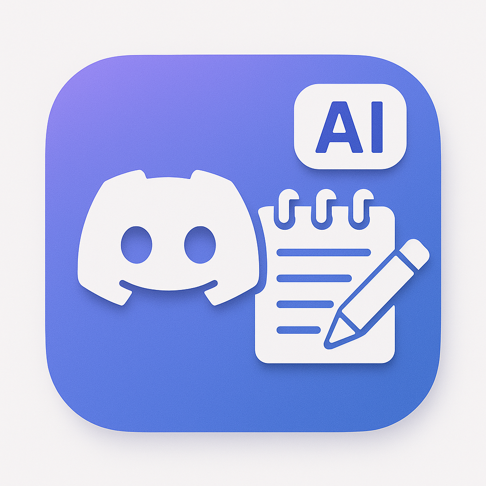

<p align="center">
  
</p>

# 🤖 Discord Meeting Recorder & Summarizer

## Descripción

Este bot de Discord graba reuniones de voz en canales seleccionados, transcribe las conversaciones y genera un resumen estructurado usando inteligencia artificial (OpenAI GPT-4). El resumen es adecuado para compartir en Discord, incluyendo participantes, temas principales, elementos de acción y notas adicionales.

---

This Discord bot records voice meetings in selected channels, transcribes the conversations, and generates a structured summary using artificial intelligence (OpenAI GPT-4). The summary is suitable for sharing on Discord, including participants, main topics, action items, and additional notes.

---

## Características / Features

- 🎙️ Graba audio de canales de voz en Discord.
- 📝 Transcribe automáticamente la conversación.
- 🤖 Genera un resumen profesional y estructurado con IA.
- 📋 Incluye participantes, temas principales, acciones y notas.
- 📂 Guarda transcripciones y resúmenes en archivos.
- 🇪🇸 Resúmenes en español (es-CO) y formato Markdown para Discord.

---

- 🎙️ Records audio from Discord voice channels.
- 📝 Automatically transcribes the conversation.
- 🤖 Generates a professional, structured summary with AI.
- 📋 Includes participants, main topics, action items, and notes.
- 📂 Saves transcripts and summaries to files.
- 🇪🇸 Summaries in Spanish (es-CO) and Discord-friendly Markdown format.

---

## Instalación / Installation

1. **Clona el repositorio / Clone the repository:**

   ```bash
   git clone https://github.com/tuusuario/discord-meeting-bot.git
   cd discord-meeting-bot
   ```

2. **Instala las dependencias / Install dependencies:**

   ```bash
   npm install
   ```

3. **Configura las variables de entorno / Set up environment variables:**

   Crea un archivo `.env` o edita `local.env` con tus claves:

   ```
   DISCORD_TOKEN=tu_token_de_discord
   OPENAI_API_KEY=tu_api_key_de_openai
   ```

4. **Inicia el bot / Start the bot:**

   ```bash
   node index.js
   ```

---

## Uso / Usage

1. Invita el bot a tu servidor de Discord con permisos de voz.
2. Mueve el bot a un canal de voz para iniciar la grabación (escribe !join en el chat del canal de voz).
3. Cuando el bot salga del canal, la grabación se detendrá y se generará un resumen.
4. Los archivos de transcripción y resumen se guardarán en la carpeta `recordings/` y `scripts/`.

---

1. Invite the bot to your Discord server with voice permissions.
2. Move the bot to a voice channel to start recording.
3. When the bot leaves the channel, recording stops and a summary is generated.
4. Transcript and summary files are saved in the `recordings/` and `scripts/` folders.

---

## Notas / Notes

- El resumen es generado automáticamente por IA y puede contener imprecisiones.
- El bot está optimizado para español (es-CO), pero puedes adaptar el prompt para otros idiomas.
- Asegúrate de cumplir con las políticas de privacidad y consentimiento de grabación en tu país y servidor.

---

- The summary is automatically generated by AI and may contain inaccuracies.
- The bot is optimized for Spanish (es-CO), but you can adapt the prompt for other languages.
- Make sure to comply with privacy and recording consent policies in your country and server.

---

## Créditos / Credits

Desarrollado por jhonarias1322@gmail.com.  
Powered by Discord.js, OpenAI GPT-4.

---
